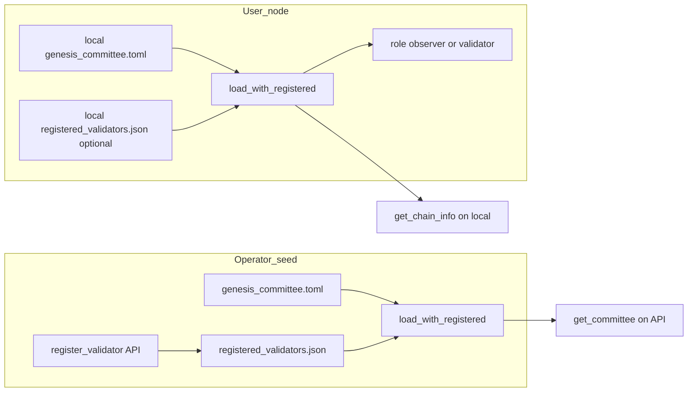

# お問い合わせ用: オブザーバー表示と接続の変動

運営・サポートが利用者へ返信する際の**文案**と、社内説明用の**技術根拠**です。

関連コード: `crates/misaka-node/src/main.rs`（`is_observer` / `role` / `register_validator`）、`crates/misaka-node/src/genesis_committee.rs`（`load_with_registered`）。

---

## 利用者向け返信（そのまま送れる短文）

件名例: MISAKA testnet — オブザーバー表示・接続について

---

お問い合わせありがとうございます。

**（1）バリデータ登録後も「オブザーバー」と表示される件**

登録 API 経由で委員会一覧にご自身の公開鍵が表示されることと、**お手元のノードの画面や API で `role` が `observer` のまま**であることは、**同時に起こり得ます**。

理由は次のとおりです。ノードは起動時に、**お手元の `config` 内の `genesis_committee.toml` と、同じフォルダにある `registered_validators.json`（存在する場合）**を読み合わせ、このマシンの `validator.key` に対応する公開鍵が委員に含まれるかで `observer` / `validator` を判定しています。登録 API で更新されるのは**主に登録先（運営ノード側）のファイル**であり、**参加者の PC に同じ内容が自動でコピーされるわけではありません**。そのため、**運営 API の一覧には載っているが、ローカルではまだオブザーバー表示**、という組み合わせが出ます。

**「自分のノードでも validator として扱われたい」**場合は、運営が案内する手順に従い、**お手元の `config` に `registered_validators.json` を配置する（または更新されたマニフェストを配布物に反映する）→ ノード再起動**が必要になることがあります。詳細は運営ドキュメントまたはサポートにてご確認ください。

参考: リポジトリ直下の [`misaka-core-v4/README.md`](../../README.md)「バリデーター登録 / 削除 API」

**（2）接続が切れたりついたりする件**

**一時的な切断と再接続**は、テストネットやネットワーク環境によって**ある程度は発生し得ます**。  
一方、**長時間にわたり激しく繰り返す**場合は、**ファイアウォール・ポート開放・NAT**などを疑う必要があります。`get_chain_info` の `topology` が `joined` と `solo` のどちらを示すか、発生時刻・ご利用環境（自宅/クラウド等）をお知らせいただけると調査しやすくなります。

---

## 社内メモ（技術根拠）

- **`role`**: マニフェスト上の `authority_index` と公開鍵の組が `manifest.contains(...)` を満たすかで `observer` が決まる（起動時に `load_with_registered` で読み込んだマニフェストが対象）。
- **`registered_validators.json`**: `genesis_committee.toml` と**同じディレクトリ**に置く。`/api/register_validator` は**そのリクエストを処理したノード**の `config/` 側に `registered_validators.json` を書き込む。
- **運営 API の `get_committee`** と **ローカル `get_chain_info`** は、**それぞれのノードが読み込むマニフェスト**に基づくため、見え方が一致しないことがある。
- **接続の変動**: 運営 seed が `MISAKA_ACCEPT_OBSERVERS` 等でオブザーバー接続を受け付けない場合、握手や接続に失敗しログに警告が出ることがある（コードコメント参照）。短時間の flapping はあり得るが、持続しない場合はネットワーク要因を疑う。

## 図（説明用）

---

## 返信時の注意

- 利用者の個別キー・パスワードは返信に含めない。
- 「不具合です」と断定せず、**実装と運用上の想定**と**次に確認してほしい点**に留める。
